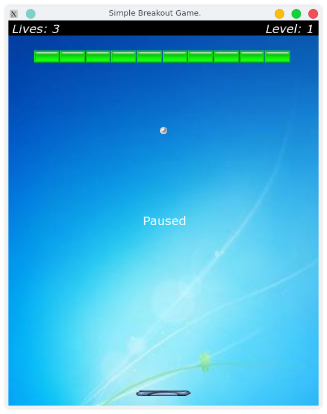

A basic Breakout game that was in the Advanced C++ course on Udemy.
I modified almost all of the code, so this is nothing like the actual one from the course. 
Code that I added:
<ul>
    <li>Text box on top to display lives/level.</li>
    <li>Row of bricks change depending on the level.</li>
    <li>Random stronger bricks are added as level increases.</li>
    <li>Added additional colours of bricks according to strength of the brick (red/blue/green).</li>
    <li>Speed of ball changes as level increases.</li>
    <li>Added additional spin etc to the paddle/ball connection to adjust the trajectory of the ball if paddle is moving when the ball hits it.</li>
    <li>Increase paddle size if increase_paddle sprite is hit.</li>
    <li>Split the Game class into multiple .cpp files.</li>
    <li>Various other changes.</li>
</ul>


### Breakout template
To install the required files on Debian/Ubuntu systems run:
```bash
apt install cmake g++ extra-cmake-modules xorg-dev libudev-dev libopenal-dev libvorbis-dev libflac-dev libsfml-dev
```
This template is packaged using CMake.
To build it you can run:
```bash
mkdir -p build
cmake --build build
```
The file 'Breakout' will be in the build/bin directory. Run it using this command:
```bash
build/bin/Breakout
```

To clean it, run this command in the build directory:
```bash
cmake --build build --target clean
```

It you want to create multiple templates you can add new directories to the root
of this project and add them to the template package macro:  
```cmake
kde_package_app_templates(TEMPLATES "Breakout" "mysecondtemplate" INSTALL_DIR ...)
```

